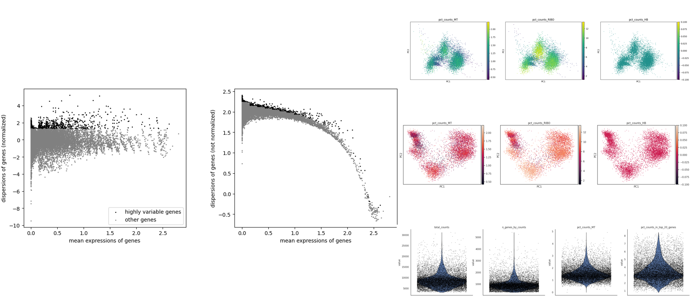
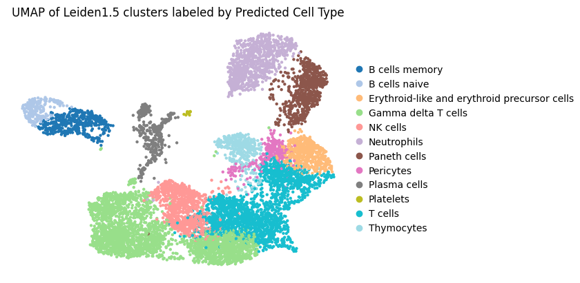
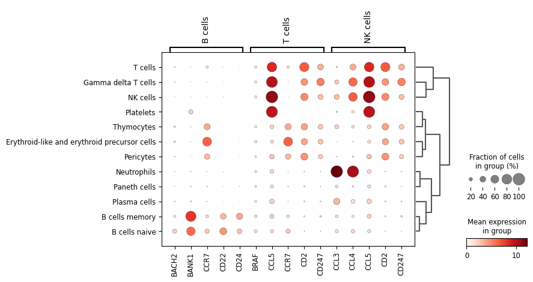

# Analysis of bone marrow single-cell dataset available from the CZI CellxGene portal

## Code
Available in this repository:

1) **Data preprocessing** → `scRNA_analysis_QC.py`  
   Create QC plots to preprocess data and select highly variable genes.  
   

2) **Dimension Reduction and Annotation** → `scRNA_analysis_DR.py`  
   Create plots for biological insight.

   

## Findings
### Cell types
Data set contained 14,783 cells and 17,374 genes.

 **UMAP of cells annotated by predicted cell type**  
   

**Cell type description:**
* **B cells memory:** Long-lived lymphocytes that retain the specific antibody information from a previous infection, enabling faster and stronger antibody response upon re-exposure to the same pathogen.
* **B cells naive:** Mature but inexperienced B lymphocytes that have not yet encountered a specific antigen.
* **Erythroid-like and erythroid precursor cells:** Hematopoietic cells in the bone marrow that are on the path to becoming mature, oxygen-carrying red blood cells (erythrocytes).
* **Gamma delta T cells:** Unique subset of T cells that patrol epithelial and mucosal surfaces, acting as a bridge between the innate and adaptive immune systems.
* **NK cells (Natural Killer cells):** Innate lymphocytes that kill host cells lacking 'self' markers (MHC class I), making them crucial for early defense against viruses and cancer.
* **Neutrophils:** Most abundant white blood cell, for phagocytosing and killing invading bacteria.
* **Paneth cells:** Specialized epithelial cells located in the small intestine and secrete antimicrobial peptides to maintain the gut barrier.
* **Pericytes:** Mural cells embedded in the basement membrane of capillaries and venules and help with regulating blood-brain barrier integrity.
* **Plasma cells:** Fully differentiated B cell progeny that are dedicated antibody factories, secreting large amounts of a single type of antibody.
* **Platelets:** Small, anucleate cell fragments important for blood clotting and wound repair.
* **T cells:** Key lymphocytes of the adaptive immune system that differentiate into cytotoxic killers or helper cells.
* **Thymocytes:** Developing lymphocytes found in the thymus that undergo selection processes to mature into functional, self-tolerant T cells.

## How do cell types correlate with expected bone marrow lineage population
This dataset is highly consistent with a bone marrow sample. A bone marrow sample is the primary site of adult hematopoiesis, meaning it should contain all major blood cell lineages, including immature and mature stages. The UMAP plot successfully displays all of these expected lineages:
                    * **Myeloid	Monocytes:** *Neutrophils and Macrophages*
                    * **Lymphoid:** *B-cells, T-cells, NK cells, Plasma Cells*
                    * **Erythroid**
                    * **Progenitors/Stem Cells**

## Expected frequency distribution for a bone marrow

 **Dotplot of marker genes**  
   

The dominance of Myeloid and B-cell lineages, along with the presence of immature populations, are the hallmarks of an active hematopoietic organ like the bone marrow, as opposed to peripheral blood mononuculear cells (PBMCs). With PBMCs, T-cells are typically the most abundant population. In bone marrow, T-cells and NK cells are present as mature immune cells or tissue-resident cells, but their frequency is surpassed by the developing B-cells and the heavily produced myeloid cells.

  

