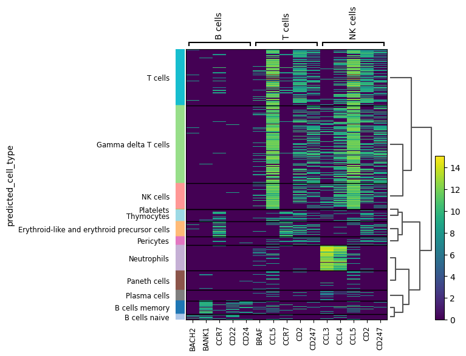
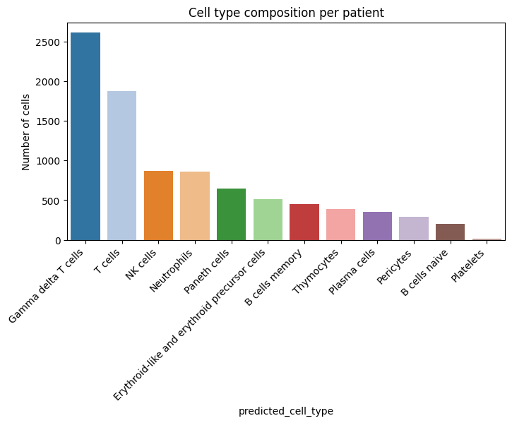
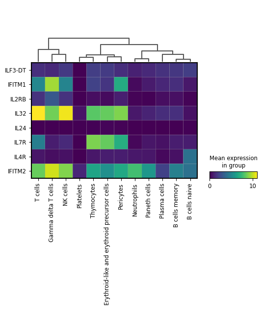

# Analysis of a single-cell dataset available from the CZI CellxGene portal

## Code
Available in this repository:

1) **Data preprocessing** → `scRNA_analysis_QC.py`  
   Create QC plots to preprocess data and select highly variable genes.  
   

2) **Dimension Reduction and Annotation** → `scRNA_analysis_DR.py`  
   Create plots for biological insight.

   

## Findings
### Cell types
Data set contained 14,783 cells and 17,374 genes.

 **UMAP of cells annotated by predicted cell type**  
   

**Cell type description:**
* **B cells memory:** Long-lived lymphocytes that retain the specific antibody information from a previous infection, enabling faster and stronger antibody response upon re-exposure to the same pathogen.
* **B cells naive:** Mature but inexperienced B lymphocytes that have not yet encountered a specific antigen.
* **Erythroid-like and erythroid precursor cells:** Hematopoietic cells in the bone marrow that are on the path to becoming mature, oxygen-carrying red blood cells (erythrocytes).
* **Gamma delta T cells:** Unique subset of T cells that patrol epithelial and mucosal surfaces, acting as a bridge between the innate and adaptive immune systems.
* **NK cells (Natural Killer cells):** Innate lymphocytes that kill host cells lacking 'self' markers (MHC class I), making them crucial for early defense against viruses and cancer.
* **Neutrophils:** Most abundant white blood cell, for phagocytosing and killing invading bacteria.
* **Paneth cells:** Specialized epithelial cells located in the small intestine and secrete antimicrobial peptides to maintain the gut barrier.
* **Pericytes:** Mural cells embedded in the basement membrane of capillaries and venules and help with regulating blood-brain barrier integrity.
* **Plasma cells:** Fully differentiated B cell progeny that are dedicated antibody factories, secreting large amounts of a single type of antibody.
* **Platelets:** Small, anucleate cell fragments important for blood clotting and wound repair.
* **T cells:** Key lymphocytes of the adaptive immune system that differentiate into cytotoxic killers or helper cells.
* **Thymocytes:** Developing lymphocytes found in the thymus that undergo selection processes to mature into functional, self-tolerant T cells.

## How do cell types correlate with expected bone marrow lineage population
This dataset is not consistent with a bone marrow sample. A bone marrow sample is the primary site of adult hematopoiesis, meaning it should contain majority hematopoietic stem/progenitors. This lineage is not present at all in the UMAP. Instead, the UMAP plot successfully displays expected lineages in a blood sample population:
* **Myeloid	Monocytes:** *Neutrophils and Macrophages*
* **Lymphoid:** *B-cells, T-cells, NK cells, Plasma Cells*
* **Erythroid**
* **Progenitors/Stem Cells**

Upon further analysis, the presence of individual bone marrow markers where searched. These included $CD34, $PROM1, and $KIT. None of these were found. The lack of these classical progenitor markers strongly suggest that data is likely from peripheral blood mononuculear cells (PBMCs), blood immune cells, or tissue-resident immune cells.
Another abnormal findings to suggest that the data is not from a bone marrow sample are the presence of non-hematopoietic cells such as paneth cells and pericytes. 

## Expected frequency distribution for a bone marrow

 **Dotplot of marker genes**  
   

The dominance of immature populations such as hematopoietic stem cells and myeloid cells , are the hallmarks of an active hematopoietic organ like the bone marrow. Our data set shows T-cells to be the most abundant population, strongly suggesting these are not bone marrow samples. T-cells and NK cells are present in abundance in PBMCs.

## Healthy or infected?

 **Heatmap of marker genes**  
   

Our dataset shows high expression of markers like $CCL3$, $CCL4$, and $CCL5$ in T-cells and NK cells. These are major inflammatory chemokines and their upregulation stronly suggests immune activation during viral or bacterial infection.

 **Cell type count**  
   

The cell count bar plot reveals an overwhelming dominance of Gamma delta T-cells. Thus suggesting infected cell data. 

 **Expression pattern of Interferon-Stimulated Genes (ISGs) and Interleukin (IL) receptors**  
   

High expressions of $IFITM1$ and $IFITM2$ (classic antiviral proteins) in T-cells, Gamma delta T-cells, and NK cells is a strong signature of an ongoing antiviral immune response.  $IL-32 is a multifaceted cytokine associated with several diseases and inflammatory conditions. Its expression is induced in response to cellular stress.

The data is highly consistent with patients undergoing a significant infectious or inflammatory episode, most likely triggered by a viral pathogen, given the strong interferon-stimulated gene signature and the extensive activation and proliferation of the cytotoxic T and NK cell lineages.

## Learning material from:
* https://internship.thehackbio.com
* https://www.youtube.com/@sanbomics

